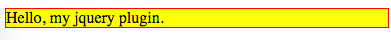

JQuery Plugin Hello World Demo
==============================

JQuery Plugin，就是在JQuery上提供一些函数，这些函数和JQuery融为一体，看起来就像是JQuery自己提供的功能。

JQuery Plugin写起来非常简单，很好。

```
npm install
open index.html
```



Resources
---------

- How to Create a Basic Plugin: <https://learn.jquery.com/plugins/basic-plugin-creation/>